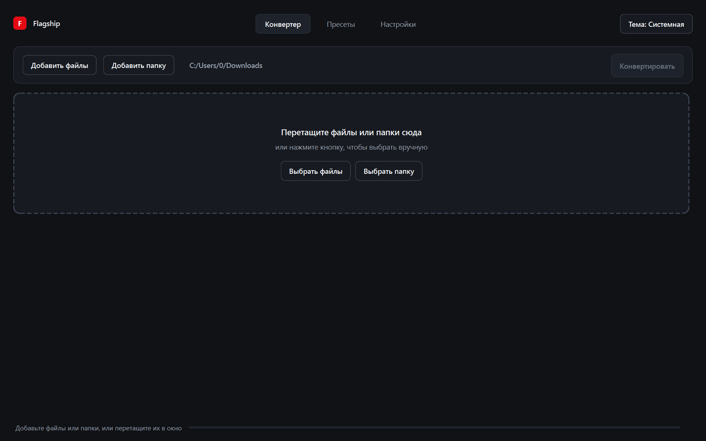

# Flagship Converter

Privacy-first file converter for Windows. Everything runs locally on your
machine — no uploads, no accounts, no telemetry.



## Features

- **Images** — convert PNG, JPEG, WebP, BMP, TIFF, AVIF (opens HEIC/HEIF and
  GIF too), with per-file quality control.
- **Video** — convert MP4, MKV, AVI, MOV, WebM, FLV, M4V; compress to an exact
  target file size (fit any upload limit), extract audio (MP3, WAV, FLAC, AAC,
  OGG) or turn clips into GIFs.
- **Audio** — convert MP3, WAV, FLAC, AAC, M4A, OGG, WMA.
- **Documents** — PDF ↔ DOCX ↔ Markdown with layout-aware parsing and built-in
  OCR, so scanned PDFs work too.
- **Batch queue** — drop files or whole folders, convert in parallel, per-file
  settings and reusable presets.
- **Desktop-grade UX** — light/dark theme, English and Russian interface.

## Download

Get the latest version from the
[Releases page](https://github.com/PASII11/flagship_converter/releases/latest):

| File | What it is |
| --- | --- |
| `FlagshipConverter-Setup-<version>.exe` | Installer — recommended. Start menu shortcut, in-place upgrades, uninstaller. |
| `FlagshipConverter-<version>-portable-win64.zip` | Portable build — unzip anywhere and run `FlagshipConverter.exe`. |

**System requirements:** Windows 10/11 x64, ~3 GB of free disk space. FFmpeg,
OCR models and document parsers are bundled — nothing else to install.

On startup the app makes a single anonymous request to GitHub to check for a
new release and shows an "Update available" button if there is one. Nothing is
ever sent anywhere.

## Build from source

Requires [uv](https://docs.astral.sh/uv/), plus `ffmpeg` and `wkhtmltopdf`
available on `PATH`.

```bash
uv sync
uv run python -m pytest                    # run tests
uv run python -m flagship_converter.app    # run from source
uv run python build.py                     # build dist/FlagshipConverter
```

Releases are built with `uv run python release.py` (needs Inno Setup 6 and an
authenticated gh CLI).

## License

[MIT](LICENSE)
